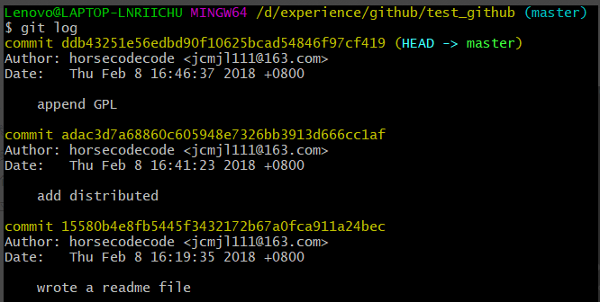
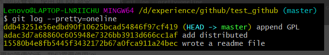

## github平台如何回退代码到历史指定版本

前提是 本地已经有了 git的origin master库 

或者克隆需要回退的代码到本地

#### 一、查询历史对应不同版本的ID ，用于回退使用

在git中，我们通过“`git log`”命令来查看版本，如下图所示：

从上图中我们可以看到，使用“`git log`”命令之后，git会返回我们每次提交的版本信息，包括一个特别长的数字、作者、时间以及每次提交的备注，如果我们希望“`git log`”命令返回的信息更加简便的话，我们需要使用命令:

``$ git log --pretty=oneline``

结果如下图所示：

使用`git log`命令查看所有的历史版本，获取你git的某个历史版本的id
  
假设查到历史版本的id是fae6966548e3ae76cfa7f38a461c438cf75ba965，这是你打算回退的版本。

#### 二、恢复到历史版本

``$ git reset --hard HEAD^``

`HEAD`指向的版本就是当前版本，因此，Git我们要在版本的历史之间穿梭，使用命令 `git reset --hard commit_id`。例如这里我们可以用：

``$ git reset --hard fae69``

回退到之前我们确定的版本，`commit_id`就是我们确认要回退的版本的id，不需要全部写出来，可以只写前几位，就像这样`fae69`。

#### 三、把修改推到远程服务器

``$ git push -f -u origin master ``

#### 四、重新更新就可以了

`$ git pull`

#### 总结
 
 HEAD指向的版本就是当前版本，因此，Git允许我们在版本的历史之间穿梭，使用命令`git reset --hard commit_id`。
 
 穿梭前，用`git log`可以查看提交历史，以便确定要回退到哪个版本。
 
 要重返未来，用`git reflog`查看命令历史，以便确定要回到未来的哪个版本。

用`git push -f -u origin master`将修改推送到远程服务器。
